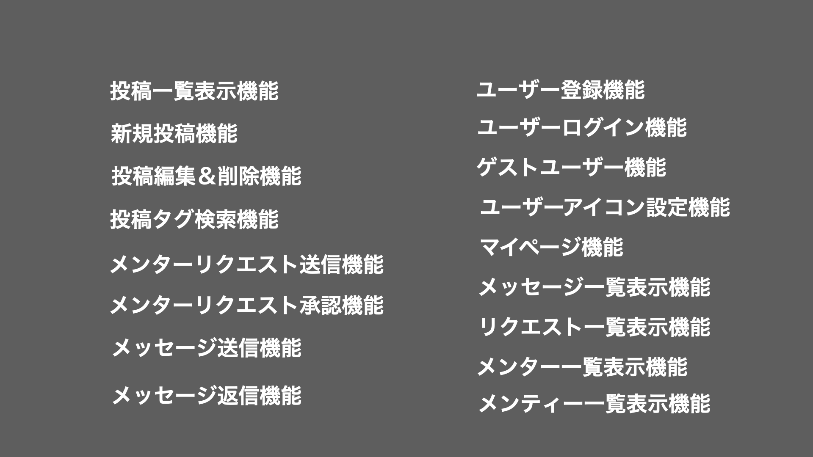

# G-MEN ゲーミングメンターサービス 
### 〜 ゲームのスキルを教えるサービス 〜

  
  &emsp;&emsp;&emsp;
  
  &emsp;&emsp;&emsp;
  

    
## App URL

### **https://game-mentor.com/**

  
## Usage

`$ git clone https://github.com/4ge44koyama/game-mentor.git`

  
### 簡単ログイン機能
#### ログインまたは新規登録の画面からゲストユーザーとしてログインできます
  

# Features

<h3 align="center">- 記事投稿 -</h3>

  

    

<h3 align="center">- 記事閲覧 -</h3>

  

    

<h3 align="center">- メッセージ送信 -</h3>

  

    

<h3 align="center">- リクエスト送信 -</h3>

  

    

<h3 align="center">- マイページ機能 -</h3>

  

    

<h3 align="center">- メッセージ返信 -</h3>

  

    

<h3 align="center">- リクエスト承認 -</h3>

  

    

<h3 align="center">- ALL -</h3>

  

 

### 5月20日追記
#### 単体テスト、統合テスト完了
### 6月19日追記
#### レビュー投稿機能追加

    

# To Be Added
- (実装済み) - メンター評価機能
- (実装済み) - フロント用技術の導入(ex.JavaScript)
- 検索機能の条件追加
- インフラ技術の拡張(ex.Docker,Circle CI/CD)

    

# 開発経緯
### ゲーム業界の市場が伸びていく中、YouTubeのコメント欄で投稿者に対して技術的な質問がたくさん投げかけられていることに気がつきました。2020年5月現在、個人が個人に対して価値提供を行うスキルや知識共有のプラットフォームはいくつかありますが、ゲームに特化するモノがなかったので自分で作ってみよう！と思い立ったのがきっかけです。
 

## メンターユーザーの想定
### ・現役プロ...誰かに教えることで自身のスキルを高める
### ・元プロ...自身の貴重な経験を元に後輩育成ができる
### ・ストリーマー(配信者)...自身のファンコミュニティーとして使用できる

## メンティーユーザーの想定
### ・プレイングの相談をしたい人
### ・業界事情やガジェットの相談をしたい人
### ・メンター自身に興味があり、より近い距離でコミュニケーションしたい人

    

# Author
- [Github](https://github.com/4ge44koyama)
- [Twitter](https://twitter.com/Koyama_codeA)
- [Qiita](https://qiita.com/Shigeyoshi_Koyama)